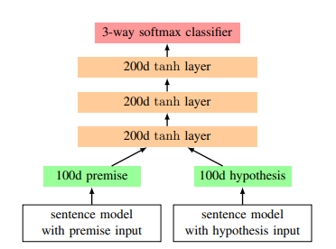

# 以下是针对SNLI数据集创建的100D-LSTM模型
[参考论文] A large annotated corpus for learning natural language inference (https://arxiv.org/pdf/1508.05326v1.pdf)

本框架主要使用了RNN和LSTM两个循环神经网络模型对文本对进行建模，  
<div align=center>
   
  <div class="caption">100D LSTM框架的示意图。</div>
</div>  

```python
torch==1.9.0
torchtext==0.10.0
spacy==3.5.2
```
  
## 在命令行终端执行文件
```python
python preprocessing.py
```
