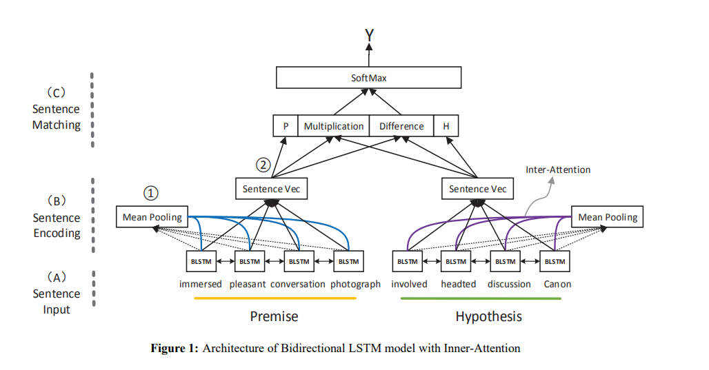

[参考论文]Learning Natural Language Inference using Bidirectional LSTM model and Inner-Attention (https://arxiv.org/pdf/1605.09090v1.pdf)  
本论文基于BiLSTM模型，提出使用内注意力机制提高模型对于SNLI数据集的精度。


<div align=center>
   
  <div class="caption">本论文框架的示意图。</div>
</div>  

```python
torch==1.9.0
torchtext==0.10.0
spacy==3.5.2
```
  
## 在命令行终端执行文件
```python
python trainning.py
```
